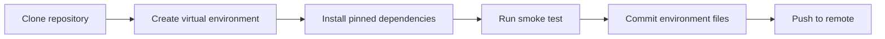

# Week 1 — Reproducible Development Environment

```mermaid
flowchart LR
    Clone[Clone repository] --> Venv[Create virtual environment]
    Venv --> Install[Install pinned dependencies]
    Install --> Check[Run smoke test]
    Check --> Commit[Commit environment files]
    Commit --> Push[Push to remote]
```

Keep `.venv/` out of Git; commit `requirements.txt` and a short setup guide instead.
