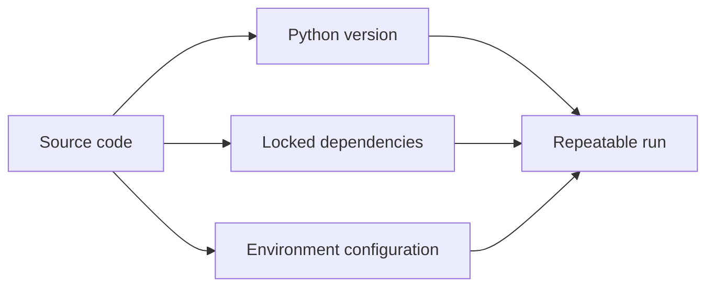

# Week 1 Lecture Pack: Foundations and Development Environment

**Level:** Undergraduate software engineering · **Suggested class time:** 120 minutes

## Learning outcomes

By the end of the class, students can explain why reproducible environments matter, create and activate a Python virtual environment, install pinned dependencies, use basic Git commands, and connect a small Python program to PostgreSQL.

## 1. Why a development environment is part of the product

Software is more than source files. It also depends on a language runtime, packages, configuration, a database, operating-system tools, and a repeatable way to run tests. A project that runs only on one laptop is not ready for collaboration.



**Key vocabulary:** runtime, package manager, virtual environment, dependency, repository, commit, remote, database client.

## 2. Python virtual environments

A virtual environment isolates project packages. Do not install every project dependency globally.

```bash
python3 -m venv .venv
source .venv/bin/activate        # macOS/Linux
python -m pip install --upgrade pip
pip install requests
pip freeze > requirements.txt
```

Ask students: What breaks if two projects need incompatible versions of the same library? Explain that `.venv/` is local and should not be committed, while `requirements.txt` records a reproducible dependency set.

## 3. Git as a collaboration history

Git stores snapshots and the relationships between snapshots. A commit should represent one understandable change.

```bash
git init
git status
git add requirements.txt src/main.py
git commit -m "Set up Python CLI and dependencies"
git branch -M main
git remote add origin <repository-url>
git push -u origin main
```

Use this mental model: the working tree is what students are editing, the staging area is what they intend to save, and a commit is the saved snapshot.

## 4. Minimal command-line application

```python
from datetime import date

def greeting(name: str) -> str:
    return f"Hello, {name}. Today is {date.today():%B %d, %Y}."

if __name__ == "__main__":
    print(greeting("Ada"))
```

Discuss `if __name__ == "__main__"`: it lets a file work both as a program and as an importable module.

## 5. PostgreSQL connection concepts

Database credentials belong in environment variables, not in Git. Show students the meaning of host, port, database, user, password, and connection string. In DBeaver, create a connection, inspect schemas, and run:

```sql
CREATE TABLE students (
  student_id SERIAL PRIMARY KEY,
  name TEXT NOT NULL,
  email TEXT UNIQUE NOT NULL
);
```

## In-class workshop (35 minutes)

1. Create a repository named `cs343-week1`.
2. Build and activate `.venv`.
3. Add `requests`, save `requirements.txt`, and add `.gitignore`.
4. Write the greeting program and run it.
5. Commit, push, and exchange repository URLs with a partner.

## Check for understanding

- Why is a virtual environment preferable to global installation?
- Which files must a teammate receive to recreate dependencies?
- What is the difference between `git add` and `git commit`?
- Why should a password not appear in source code?

## Homework

Submit the repository, a screenshot of a successful run, and a README containing setup instructions that a classmate can follow without asking you for help.

## Suggested 18-slide teaching sequence

1. **Title and course promise** — Reliable software begins with a reliable workspace.
2. **Today’s outcomes** — Read the outcomes aloud; students identify their least familiar tool.
3. **The “works on my machine” story** — Contrast a local success with a teammate’s failed setup.
4. **Environment anatomy** — Runtime, packages, configuration, database, and source control.
5. **Python versions** — Show why `python --version` belongs in a bug report.
6. **Virtual environments** — Explain isolation before demonstrating commands.
7. **Live terminal demo** — Create `.venv`, activate it, and verify the interpreter path.
8. **Dependency files** — Contrast `requirements.txt` with the ignored `.venv` directory.
9. **Project layout** — Introduce `src/`, `tests/`, README, and `.gitignore`.
10. **Hello CLI program** — Trace input, function, formatted output, and main guard.
11. **Git mental model** — Working tree, staging area, local commit, remote repository.
12. **Live Git demo** — Status, add, commit, log, and push.
13. **Good commit messages** — Compare “updates” with a focused imperative summary.
14. **PostgreSQL concepts** — Server, connection, schema, table, and row.
15. **Secrets and configuration** — Explain why `.env` is local and never public.
16. **Workshop instructions** — Teams build the repeatable starter repository.
17. **Troubleshooting clinic** — Interpreter mismatch, activation failure, Git identity, port conflict.
18. **Exit ticket** — Students write one setup step a future teammate must not miss.
