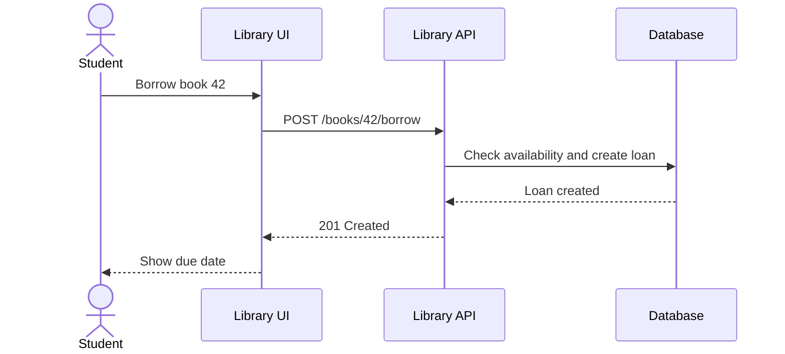

# Week 2 Lecture Pack: Requirements Engineering and User Stories

**Level:** Undergraduate software engineering · **Suggested class time:** 120 minutes

## Learning outcomes

Students can distinguish functional and non-functional requirements, elicit ambiguity through questions, write testable user stories, define acceptance criteria, and sketch a small API contract.

## 1. Requirements define observable value

A requirement describes what a system must achieve and how success can be verified. It is not a database table, screen mockup, or preferred implementation.

| Type | Example | Verification |
|---|---|---|
| Functional | A student can borrow an available book. | Create a loan and inspect book status. |
| Performance | Search returns within 500 ms for 10,000 books. | Run a load test. |
| Security | Passwords are stored only as hashes. | Inspect database and code review. |
| Usability | A keyboard-only user can submit a search. | Accessibility test. |

## 2. From vague request to testable statement

Vague request: “Make book search fast and easy.” Ask: Who searches? Which fields? What does “fast” mean? What result count is expected? What happens if no results are found?

Improved requirement: “The catalog shall return title-or-author search results within 500 ms for 95% of queries over 10,000 books.”

## 3. User stories and acceptance criteria

```text
As a registered student,
I want to borrow an available book,
so that I can read it before its due date.

Acceptance criteria
1. Given an available book, when I select Borrow, then one loan record is created.
2. Given an unavailable book, when I select Borrow, then the system explains that it is unavailable.
3. Given an active loan, when its due date passes, then it appears in my overdue list.
```

Good stories are small, valuable, negotiable, and testable. Acceptance criteria make a story measurable.

## 4. API contracts before implementation



```yaml
POST /books/{id}/borrow:
  responses:
    '201': {description: Loan created}
    '401': {description: Authentication required}
    '404': {description: Book not found}
    '409': {description: Book unavailable}
```

## 5. Stakeholder interview practice

Use open questions first: “What problem happens today?” Follow with narrowing questions: “How often?” “Who has authority to approve exceptions?” “What would make this feature a failure?” Do not promise a feature during the interview; summarize and confirm understanding.

## In-class workshop (40 minutes)

Teams receive the prompt “Build an online library.” Each team writes five user stories, two criteria per story, and three clarification questions. Exchange work with another team. The reviewing team must identify one ambiguous word and one missing error case.

## Check for understanding

- Is “The system uses React” a requirement or an implementation constraint?
- Which response status best represents an already-borrowed book?
- Can a requirement be verified if it says “user friendly” without a measure?

## Homework

Write five revised library user stories and an OpenAPI YAML fragment for search, borrow, and return operations.

## Suggested 18-slide teaching sequence

1. **Title and agenda** — Moving from vague ideas to verifiable value.
2. **Why projects fail early** — Use ambiguous expectations as the motivating problem.
3. **What is a requirement?** — Separate outcomes from UI and implementation choices.
4. **Functional requirements** — Walk through borrow, return, and search examples.
5. **Non-functional requirements** — Discuss performance, security, reliability, and accessibility.
6. **Ambiguity challenge** — Ask students to underline vague words in a sample request.
7. **Clarifying questions** — Model who, what, when, limits, and exceptions.
8. **User-story anatomy** — Introduce persona, goal, and value.
9. **Weak versus strong story** — Improve “Users manage books” together.
10. **Acceptance criteria** — Convert a story into observable Given/When/Then checks.
11. **Edge cases** — No result, unavailable book, unauthorized caller, duplicate action.
12. **API contracts** — Explain resources, paths, HTTP methods, requests, and responses.
13. **Status-code choice** — Compare 201, 400, 401, 404, and 409.
14. **Sequence diagram walk-through** — Trace borrow request from UI to database.
15. **Stakeholder interviews** — Demonstrate open versus leading questions.
16. **Group studio** — Teams author and review library stories.
17. **Peer feedback rubric** — Testability, scope, value, clarity, and errors.
18. **Exit ticket** — Rewrite one ambiguous requirement with a measurable condition.
