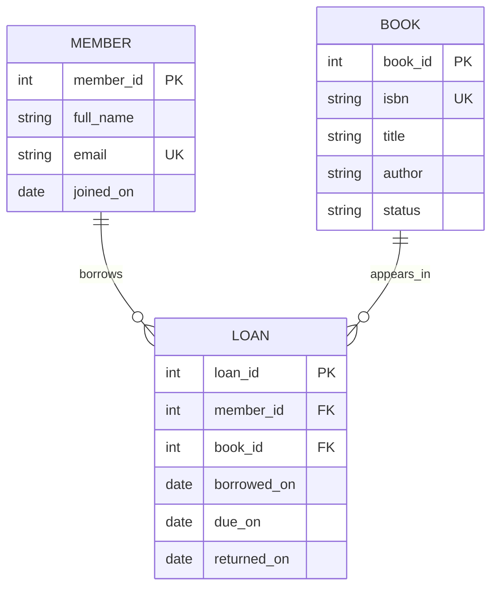
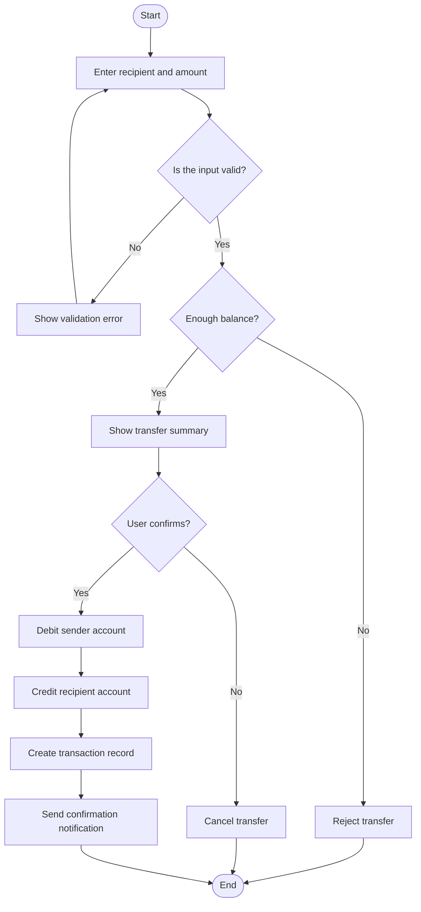
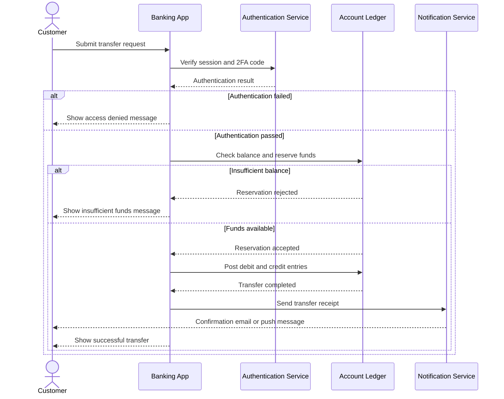
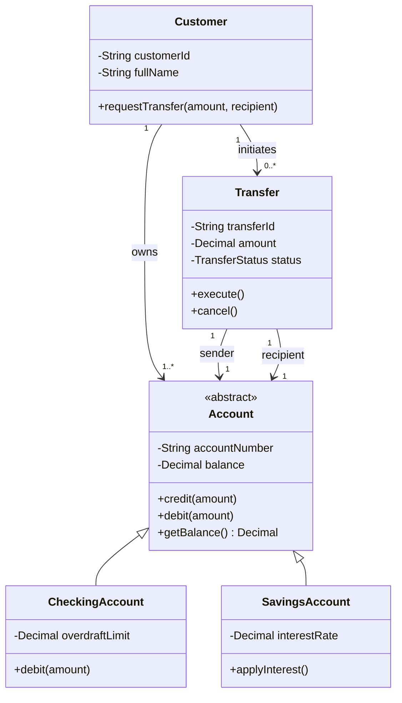
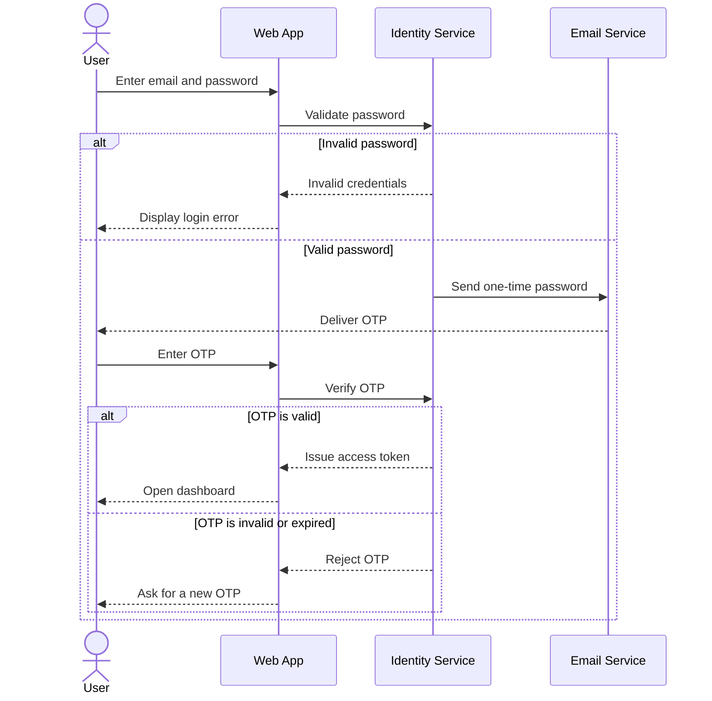
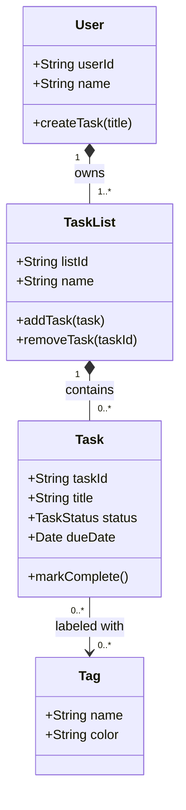
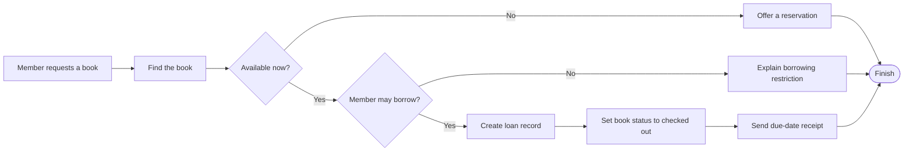

# Mermaid UML and Database Demos

These examples use English labels and are ready to paste into Markdown files that support Mermaid.

## 1. Library Database Schema (ER Diagram)

## 2. Bank Transfer Workflow (Activity / Flowchart)

## 3. Bank Transfer Interaction (Sequence Diagram)

## 4. Object-Oriented Banking Model (Class Diagram)

## 5. User Login with Two-Factor Authentication (Sequence Diagram)

## 6. To-Do List Application (Class Diagram)

## 7. Book Borrowing Process (Activity / Flowchart)

