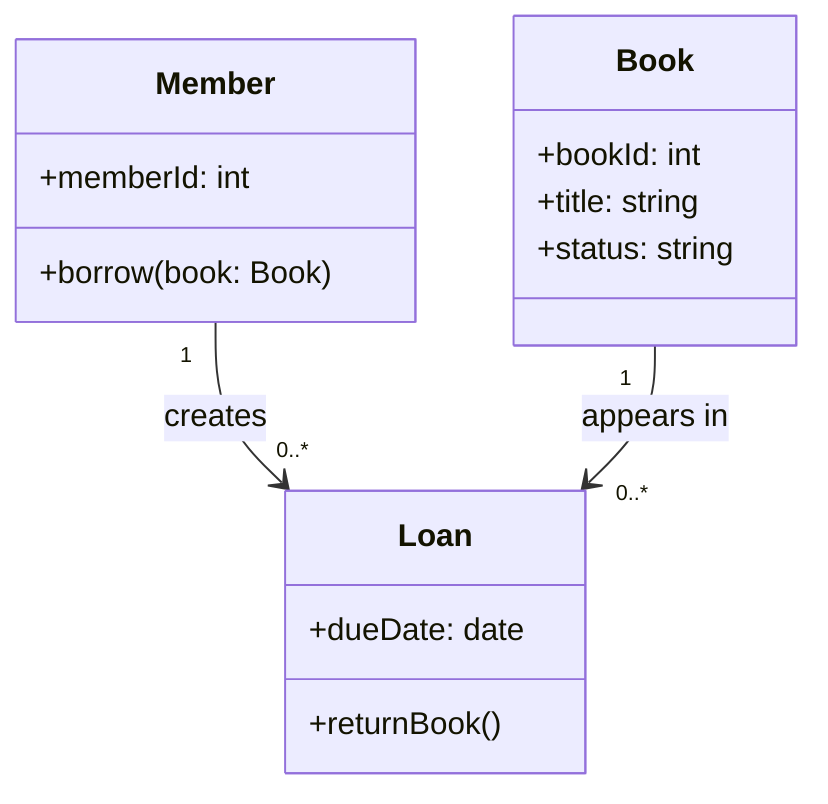
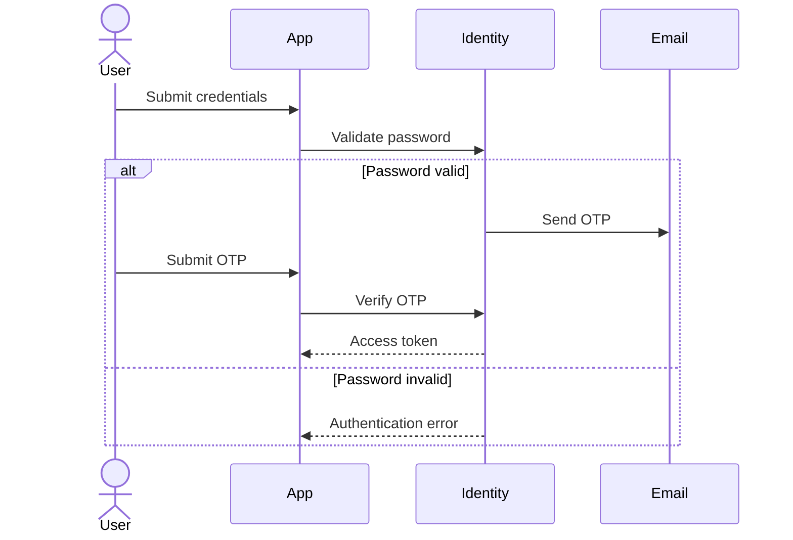
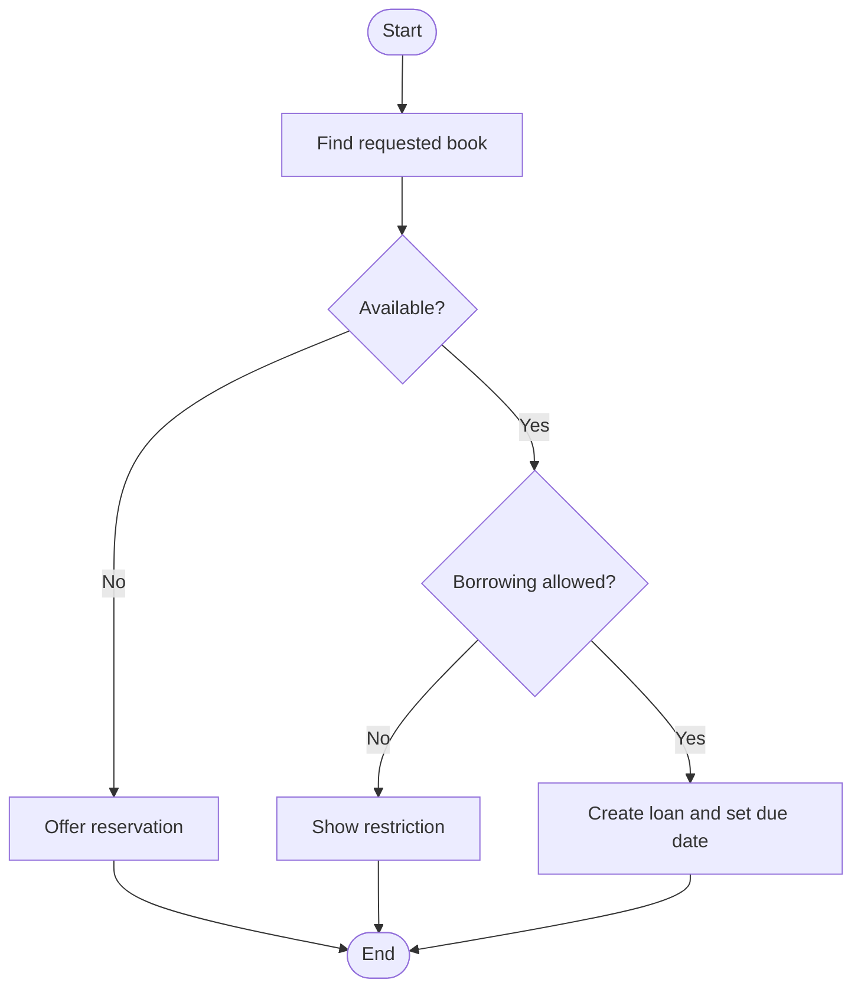

# Week 3 Lecture Pack: Visual Modeling with UML and Mermaid

**Level:** Undergraduate software engineering · **Suggested class time:** 120 minutes

## Learning outcomes

Students can choose a class, sequence, or activity diagram for a design question; read multiplicity and relationships; and turn a plain-English description into auditable Mermaid.

## 1. One system, three useful views

| Diagram | Best question | Primary focus |
|---|---|---|
| Class diagram | What entities and responsibilities exist? | Static structure |
| Sequence diagram | Who calls whom, and in what order? | Interaction over time |
| Activity diagram | What decisions and paths exist? | Workflow |

## 2. Class diagrams: structure and relationships

Explain multiplicity aloud: a member may create zero or many loans; each loan concerns one book. Do not draw an inheritance arrow merely because two classes are related.

## 3. Sequence diagrams: time and alternative paths

Ask students to identify missing cases: expired OTP, rate limiting, email delivery failure, and audit logging.

## 4. Activity diagrams: decisions are not details

Every decision should name a condition. Every branch should eventually converge or terminate.

## 5. AI-generated diagrams require review

AI can create a fast first draft, but it may invent entities, omit rejection paths, use inaccurate multiplicities, or confuse ownership with association. Treat the source description as evidence; compare every node and edge against it.

## In-class workshop (35 minutes)

Students model a to-do application in three teams: one team makes the class diagram, one the task-completion sequence diagram, and one the overdue-task activity diagram. Teams explain their model to a non-technical partner and revise one unclear part.

## Check for understanding

- Which diagram would show a retry after an email failure?
- What does `1..*` mean?
- Why is a diagram with no error paths potentially misleading?

## Homework

Write a paragraph for 2FA login, generate Mermaid, render it, and submit the diagram plus a three-item audit note.

## Suggested 18-slide teaching sequence

1. **Title and visual-thinking prompt** — Ask how a diagram can expose a missing decision.
2. **Why models matter** — Align vocabulary before code exists.
3. **UML at a glance** — Introduce the three diagrams used today.
4. **Choose the right view** — Match structure, interaction, and workflow questions.
5. **Class diagram anatomy** — Class name, fields, operations, visibility.
6. **Relationships** — Association, aggregation, composition, inheritance.
7. **Multiplicity practice** — Read `0..*`, `1`, and `1..*` as sentences.
8. **Library class demo** — Explain why Loan links Member and Book.
9. **Sequence diagram anatomy** — Actors, participants, lifelines, messages.
10. **2FA sequence demo** — Trace messages in chronological order.
11. **Alternative and failure paths** — Add invalid password and expired OTP.
12. **Activity diagram anatomy** — Actions, decisions, start, and end states.
13. **Borrowing workflow demo** — Examine each decision condition.
14. **Mermaid as diagrams-as-code** — Show Markdown source and rendered result.
15. **AI first drafts** — Discuss common hallucinated links and omissions.
16. **Three-team modeling studio** — Divide the to-do app by diagram type.
17. **Explain to a non-technical peer** — Revise labels that require jargon.
18. **Exit ticket** — Choose one diagram type and justify the choice.
