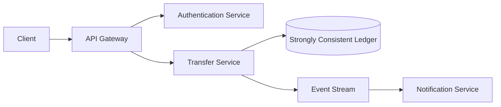

# Week 4 — Fintech Architecture Decision

```mermaid
flowchart LR
    Client --> Gateway[API Gateway]
    Gateway --> Auth[Authentication Service]
    Gateway --> Transfer[Transfer Service]
    Transfer --> Ledger[(Strongly Consistent Ledger)]
    Transfer --> Events[Event Stream]
    Events --> Notice[Notification Service]
```

**ADR decision:** Keep the ledger as a strongly consistent boundary; allow asynchronous notifications after a transfer is committed.
