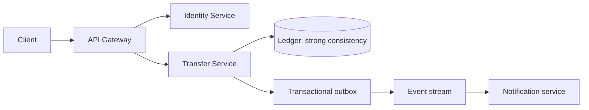

# Week 4 Lecture Pack: Software Architecture and Structural Patterns

**Level:** Undergraduate software engineering · **Suggested class time:** 120 minutes

## Learning outcomes

Students can compare monoliths and microservices, explain CAP trade-offs in context, identify cloud service models, and justify an architecture with an ADR.

## 1. Architecture is a set of important decisions

Architecture concerns boundaries that are expensive to change: deployment units, data ownership, communication patterns, scaling strategy, security controls, and operational responsibility. “Microservices” is not automatically a modern or better answer.

## 2. Monolith and microservices

| Concern | Monolith | Microservices |
|---|---|---|
| Deployment | One deployable application | Many independently deployed services |
| Early development | Usually simpler | More operational setup |
| Data | Often one shared database | Prefer service-owned data |
| Scaling | Scale whole application | Scale selected services |
| Failure modes | Fewer network boundaries | More distributed-system failures |

Start with a monolith when the team is small and the domain is changing rapidly. Split services only when independent scaling, release cadence, or ownership provides clear value.

## 3. A fintech transfer boundary

The ledger should not report a successful transfer until debit and credit entries are committed. Notifications may be asynchronous because a delayed email should not reverse money movement.

## 4. CAP theorem without slogans

During a network partition, a distributed system cannot guarantee both perfect consistency and availability for every request. The practical question is: which operation may wait or fail, and which data must never be contradictory? A banking ledger normally favors consistency; a social-media “like” counter may tolerate temporary divergence.

## 5. Containers and cloud models

A Docker image packages the application and its runtime; a container is a running instance. IaaS provides virtual infrastructure, PaaS provides a managed runtime, and SaaS provides a finished application. Containers do not eliminate the need for monitoring, secrets, backups, or deployment strategy.

## In-class workshop (35 minutes)

Choose either a real-time chat app or fintech app. Create an ADR with **Context**, **Decision**, **Consequences**, and **Alternatives considered**. Defend one trade-off to another team.

## Check for understanding

- Why might a monolith be the right first architecture?
- Which service owns the source of truth for transfer balances?
- Does eventual notification imply eventual financial consistency?

## Homework

Submit a one-page ADR and one Mermaid system diagram for the chosen application.

## Suggested 18-slide teaching sequence

1. **Title and decision prompt** — “Should every app use microservices?”
2. **Architecture definition** — Explain costly-to-change technical decisions.
3. **Quality attributes** — Scalability, latency, availability, consistency, security, cost.
4. **Monolith anatomy** — One codebase and deployment unit.
5. **Monolith strengths** — Simplicity, local calls, straightforward debugging.
6. **Monolith pressures** — Team growth, uneven scaling, and independent release needs.
7. **Microservice anatomy** — Bounded services, network calls, operational ownership.
8. **Microservice costs** — Tracing, retries, data consistency, deployment complexity.
9. **Comparison table** — Ask students to identify the default choice for an MVP.
10. **CAP context** — Focus on behavior during network partitions.
11. **Fintech case study** — Identify what cannot be eventually inconsistent.
12. **Diagram walk-through** — Ledger, outbox, events, notifications.
13. **Synchronous versus asynchronous communication** — Identify user-visible effects.
14. **Cloud models** — IaaS, PaaS, SaaS with responsibility boundaries.
15. **Containers** — Image, container, registry, deployment environment.
16. **ADR format** — Context, decision, consequences, alternatives.
17. **Architecture debate** — Teams defend chat or fintech choices.
18. **Exit ticket** — Name one trade-off their architecture accepts.
