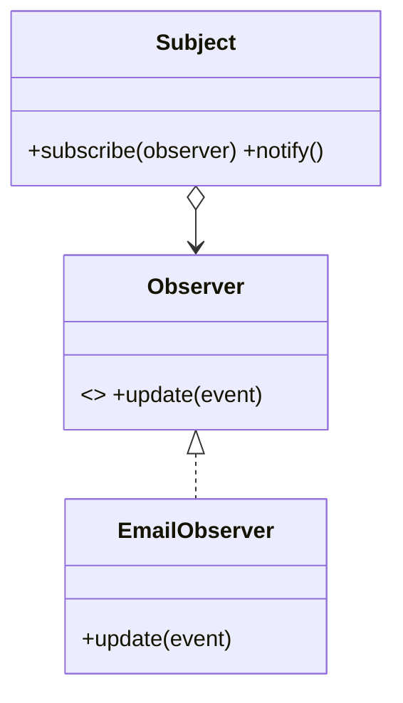

# Week 5 Lecture Pack: Object-Oriented Design, SOLID, and Patterns

**Level:** Undergraduate software engineering · **Suggested class time:** 120 minutes

## Learning outcomes

Students can recognize the five SOLID principles, refactor a small design toward clear responsibilities, and choose Factory, Strategy, or Observer for an appropriate problem.

## 1. Code quality is change quality

Good object-oriented design makes common changes local, understandable, and testable. SOLID is not a checklist for adding classes; it is a language for spotting unnecessary coupling.

| Principle | Useful question |
|---|---|
| Single Responsibility | Does this class have one reason to change? |
| Open/Closed | Can new behavior be added without editing stable code? |
| Liskov Substitution | Can a subtype safely stand in for its base type? |
| Interface Segregation | Does a client depend only on methods it needs? |
| Dependency Inversion | Does high-level policy depend on abstractions? |

## 2. Detecting a responsibility problem

An `Order` class that calculates totals, sends email, writes SQL, and formats PDFs has multiple reasons to change. Move these responsibilities behind collaborators such as `PricingService`, `OrderRepository`, and `ReceiptSender`.

## 3. Strategy: vary a rule, keep the workflow

```python
from typing import Protocol

class ShippingRule(Protocol):
    def cost(self, subtotal: float) -> float: ...

class StandardShipping:
    def cost(self, subtotal: float) -> float:
        return 0 if subtotal >= 50 else 7.99

class Checkout:
    def __init__(self, shipping: ShippingRule):
        self.shipping = shipping

    def total(self, subtotal: float) -> float:
        return subtotal + self.shipping.cost(subtotal)
```

New shipping policies can be added without changing checkout logic.

## 4. Three common patterns



- **Factory:** centralize object construction when concrete types depend on configuration or input.
- **Strategy:** select one interchangeable algorithm or policy.
- **Observer:** notify interested components after an event without making the publisher know their details.

## 5. Refactoring safely

First capture current behavior with tests. Then make one small change, run tests, commit, and repeat. Refactoring changes structure without intentionally changing external behavior; a feature change has different risk.

## In-class workshop (40 minutes)

Give students a “legacy” notification class with conditional logic for email and SMS. Teams identify three SOLID concerns, add a `Notifier` abstraction, write one test per notification type, and explain the trade-off of the new design.

## Check for understanding

- Is adding an interface always dependency inversion?
- When would a large “universal” interface violate interface segregation?
- Which pattern fits changing discount calculations at runtime?

## Homework

Create a before-and-after pull request. In the description, name three applied SOLID principles and cite the tests that preserve behavior.

## Suggested 18-slide teaching sequence

1. **Title and code-smell prompt** — What makes a change unexpectedly dangerous?
2. **Maintainability definition** — Connect structure to future change cost.
3. **SOLID overview** — Present five questions, not five rules to memorize.
4. **Single responsibility** — Diagnose an Order class that does everything.
5. **Open/closed** — Add a rule without editing stable workflow code.
6. **Liskov substitution** — Explain behavioral promises of subtypes.
7. **Interface segregation** — Show a client burdened by unused methods.
8. **Dependency inversion** — Contrast policy depending on concrete SMTP with an abstraction.
9. **Refactoring case** — Mark responsibilities in legacy notification code.
10. **Strategy pattern** — Walk through interchangeable shipping rules.
11. **Factory pattern** — Explain centralized construction and configuration.
12. **Observer pattern** — Trace event publication to interested listeners.
13. **Pattern selection** — Avoid using a pattern when a function is clearer.
14. **Tests before change** — Introduce characterization tests.
15. **Small-step refactoring loop** — Change, test, commit, repeat.
16. **Group refactoring studio** — Teams transform a legacy class.
17. **Code review language** — Make specific, respectful, evidence-based comments.
18. **Exit ticket** — Identify one SOLID concern in a familiar program.
