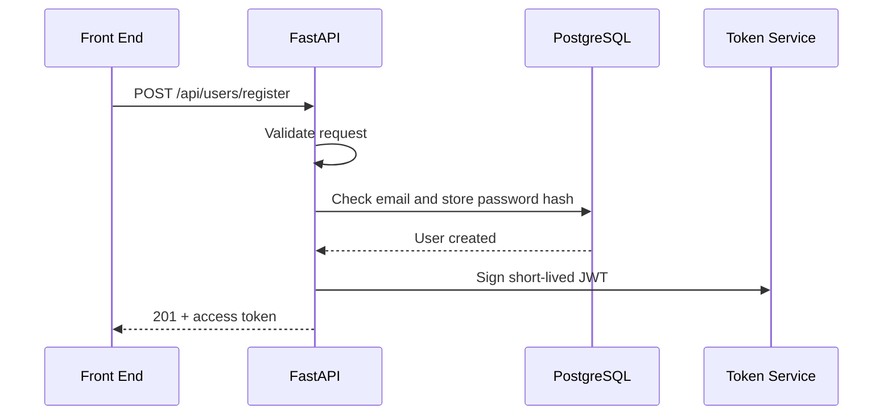

# Week 7 Lecture Pack: Back-End Development and API Integration

**Level:** Undergraduate software engineering · **Suggested class time:** 120 minutes

## Learning outcomes

Students can design REST endpoints, validate inputs, persist data through an ORM, explain JWT authentication, and connect a front end safely to an API.

## 1. REST resources and HTTP semantics

Design URLs around nouns: `/users`, `/books/42`, `/loans`. Use HTTP methods consistently: GET reads, POST creates, PUT replaces, PATCH partially updates, and DELETE removes.

| Status | Meaning | Registration example |
|---|---|---|
| 201 | New resource created | User was registered. |
| 400/422 | Invalid request | Password is too short. |
| 401 | Unauthenticated | Token is missing or invalid. |
| 409 | State conflict | Email already exists. |
| 500 | Server fault | Unexpected database failure. |

## 2. Request validation is a security boundary

```python
from pydantic import BaseModel, EmailStr, Field

class RegisterRequest(BaseModel):
    name: str = Field(min_length=1, max_length=100)
    email: EmailStr
    password: str = Field(min_length=8, max_length=128)
```

Validate data before business logic. Parameterized ORM queries help prevent SQL injection; password hashing protects credentials if the database leaks.

## 3. Registration request lifecycle



## 4. JWTs are signed claims, not magic sessions

A JSON Web Token commonly includes a subject, expiry, issuer, and signature. The server verifies the signature before trusting claims. Keep tokens short-lived; do not put secrets or passwords in a token; use HTTPS.

## 5. Idempotency and duplicate clicks

Networks retry and users double-click. For creation endpoints with financial or irreversible effects, accept an idempotency key and return the same outcome for a repeated request. Disable a front-end submit button while the request is pending, but do not rely on UI behavior alone.

## In-class workshop (40 minutes)

Implement a registration endpoint. Test successful registration, invalid email, short password, duplicate email, and a request with unexpected fields. Pair one API team with one UI team to agree on the JSON contract.

## Check for understanding

- Why is a plaintext password unacceptable even in a private database?
- Why is duplicate email a conflict rather than a server error?
- What should a client do after a 401 response?

## Homework

Connect Week 6’s form to the endpoint and document five request/response examples in the README.

## Suggested 18-slide teaching sequence

1. **Title and request journey** — Follow a form submission to a database.
2. **Client/server boundary** — Explain why UI validation is not enough.
3. **REST resource design** — Nouns, paths, and predictable URLs.
4. **HTTP methods** — Compare safe reads with state-changing requests.
5. **Status codes** — Select codes based on client action.
6. **JSON contract** — Required fields, types, examples, and errors.
7. **Validation model** — Demonstrate Pydantic constraints.
8. **Database modeling** — User identifier, unique email, password hash.
9. **ORM role** — Map application objects to parameterized database operations.
10. **Registration live-code demo** — Validate, check duplicate, persist, respond.
11. **Password handling** — Hash, salt, never log or return secrets.
12. **JWT anatomy** — Header, claims, signature, expiry.
13. **Protected endpoint** — Verify token before business logic.
14. **Idempotency** — Explain retries and duplicate clicks.
15. **Front-end integration** — Pending, success, validation, and network-error states.
16. **API contract studio** — UI and API teams negotiate one endpoint.
17. **Threat review** — Identify five misuse cases for registration.
18. **Exit ticket** — Choose a status code for a duplicate registration and explain.
