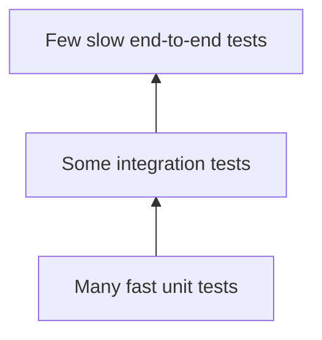

# Week 8 Lecture Pack: Software Testing Strategies

**Level:** Undergraduate software engineering · **Suggested class time:** 120 minutes

## Learning outcomes

Students can distinguish unit, integration, and end-to-end tests; write pytest tests for normal and edge cases; interpret coverage carefully; and report a reproducible defect.

## 1. The testing pyramid



Unit tests isolate a small rule. Integration tests verify components work together. End-to-end tests exercise a user-visible journey. The pyramid is a cost model, not a rigid law.

## 2. Arrange, Act, Assert

```python
def test_password_requires_eight_characters():
    # Arrange
    payload = {"email": "ada@example.com", "password": "short"}
    # Act
    result = validate_registration(payload)
    # Assert
    assert result.errors["password"] == "must be at least 8 characters"
```

One test should tell a clear story. Avoid tests that assert private implementation details when an observable outcome would be clearer.

## 3. Input partitions and boundary values

For a password minimum of eight characters, test 7, 8, and 9 characters. For an age range 18–120, test 17, 18, 120, and 121. Consider null, empty, large, malformed, duplicated, and hostile inputs.

## 4. Integration testing an endpoint

```python
def test_register_returns_201_for_valid_user(client):
    response = client.post("/api/users/register", json={
        "name": "Ada", "email": "ada@example.com", "password": "correct-horse"
    })
    assert response.status_code == 201
    assert "access_token" in response.json()
```

Use an isolated test database or transaction rollback. Never point automated tests at production.

## 5. Coverage and mutation thinking

Coverage reports which lines executed, not whether important behavior was asserted. Ask: would this test fail if `>= 8` accidentally became `> 8`? If not, add a boundary assertion.

## In-class workshop (40 minutes)

Create a test matrix for registration. Then write unit tests for validation and integration tests for HTTP status codes. Swap test suites: another team intentionally changes one rule and sees whether your tests catch it.

## Check for understanding

- Is 100% line coverage proof that code is correct?
- Which test type should check a Pydantic validation rule?
- What evidence makes a bug report reproducible?

## Homework

Submit a test suite, coverage report, one bug report with steps to reproduce, and one example of an edge case discovered with AI assistance.

## Suggested 18-slide teaching sequence

1. **Title and confidence prompt** — What evidence says a feature works?
2. **Cost of defects** — Connect early testing to lower repair cost.
3. **Testing pyramid** — Unit, integration, and end-to-end purpose.
4. **Test vocabulary** — Fixture, assertion, mock, regression, flaky test.
5. **Arrange/Act/Assert** — Read a simple test as a behavior story.
6. **Equivalence partitions** — Group inputs that should behave alike.
7. **Boundary values** — Test immediately below, at, and above limits.
8. **Negative cases** — Missing, malformed, duplicate, unauthorized, hostile input.
9. **Unit-test demo** — Validate password and email rules.
10. **Integration-test demo** — POST request and isolated database assertion.
11. **Test data hygiene** — Determinism, cleanup, and no production data.
12. **Mocks and fakes** — Use them to control unstable external services.
13. **Coverage limits** — Explain why executed lines are not correctness.
14. **Mutation thought experiment** — Would tests catch a changed comparison operator?
15. **Bug report template** — Environment, steps, expected, actual, evidence.
16. **Test-matrix studio** — Teams enumerate registration cases.
17. **Break another team’s suite** — Make a tiny defect and observe coverage.
18. **Exit ticket** — Supply one high-value boundary test.
