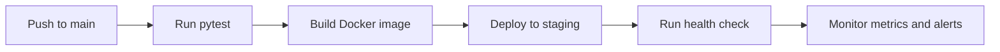

# Week 9 — CI/CD Pipeline

```mermaid
flowchart LR
    Push[Push to main] --> Test[Run pytest]
    Test --> Build[Build Docker image]
    Build --> Stage[Deploy to staging]
    Stage --> Check[Run health check]
    Check --> Monitor[Monitor metrics and alerts]
```

Block deployment when tests fail; retain build logs and the image tag for rollback.
