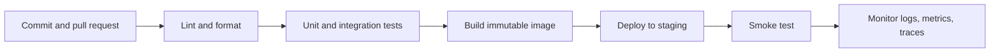

# Week 9 Lecture Pack: CI/CD and DevOps

**Level:** Undergraduate software engineering · **Suggested class time:** 120 minutes

## Learning outcomes

Students can explain continuous integration and delivery, design a safe pipeline, read a failed build, distinguish deployment from release, and describe basic production monitoring.

## 1. The feedback loop

Continuous integration means every small change is integrated and automatically checked. Continuous delivery keeps a deployable build ready; continuous deployment automatically releases approved builds. The aim is faster, safer feedback—not automation for its own sake.



## 2. A minimal GitHub Actions workflow

```yaml
name: verify
on: [push, pull_request]
jobs:
  test:
    runs-on: ubuntu-latest
    steps:
      - uses: actions/checkout@v4
      - uses: actions/setup-python@v5
        with: {python-version: '3.12'}
      - run: pip install -r requirements.txt
      - run: pytest -q
```

Protect the main branch so an unreviewed or failed change cannot be merged.

## 3. Containers and deployment artifacts

Build once, promote the same image through environments. An image tag should identify the source revision. Configuration such as database URLs and API keys belongs outside the image, delivered as environment variables or a secrets mechanism.

## 4. Observability: what happened and why?

- **Logs:** discrete events, such as a request error.
- **Metrics:** numbers over time, such as error rate or latency.
- **Traces:** a request’s path through multiple services.

Useful service-level indicators include availability, latency, traffic, error rate, and saturation. Alert on symptoms that affect users, not every unusual internal event.

## 5. Incident response

First stabilize: pause rollout, rollback, or reduce traffic. Then gather timestamps, error messages, recent changes, and impact. Communicate what is known, what is unknown, and the next update time. A blameless post-incident review improves the system rather than searching for a person to punish.

## In-class workshop (40 minutes)

Create a pipeline for the Week 7 API. Deliberately introduce a failing test, read the log, fix the failure, and record the diagnosis. Add a `/health` endpoint and define one latency alert.

## Check for understanding

- Why is a Docker image tag useful during rollback?
- What is the difference between deployment and release?
- Why can an alert based only on CPU usage be misleading?

## Homework

Submit the workflow YAML, a screenshot of a successful run, and a short incident note for one intentionally failed pipeline.

## Suggested 18-slide teaching sequence

1. **Title and delivery problem** — Why manual release checklists fail.
2. **CI/CD definitions** — Integration, delivery, deployment, and release.
3. **Feedback-loop diagram** — Trace a commit to monitored service.
4. **Pipeline stages** — Lint, test, build, deploy, verify.
5. **Branch protection** — Explain checks, review, and merge gates.
6. **GitHub Actions anatomy** — Event, job, runner, step, action.
7. **YAML walkthrough** — Read the minimal test workflow line by line.
8. **Artifacts** — Logs, test reports, image tags, and deployment metadata.
9. **Containers** — Build once and promote the same image.
10. **Environment configuration** — Separate code, config, and secrets.
11. **Staging purpose** — What staging can and cannot validate.
12. **Health checks** — Liveness, readiness, and smoke tests.
13. **Observability pillars** — Logs, metrics, traces.
14. **Useful alerts** — User-impact symptoms and service objectives.
15. **Incident timeline** — Stabilize, investigate, communicate, learn.
16. **Pipeline lab** — Break and repair a test job.
17. **Rollback discussion** — Decide what artifact enables safe rollback.
18. **Exit ticket** — Name the first pipeline gate for a risky change.
