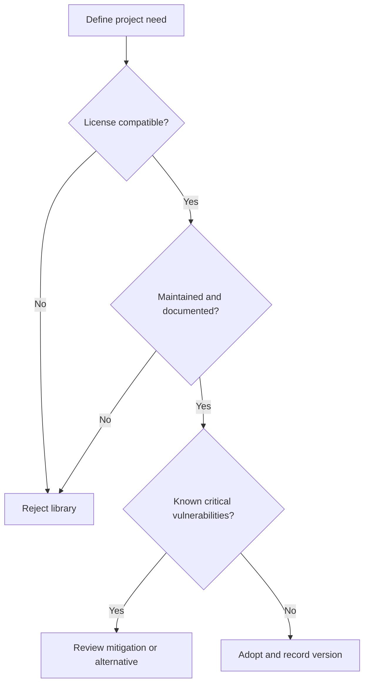

# Week 10 — Dependency Selection Checklist

```mermaid
flowchart TD
    Need[Define project need] --> License{License compatible?}
    License -- No --> Reject[Reject library]
    License -- Yes --> Maintained{Maintained and documented?}
    Maintained -- No --> Reject
    Maintained -- Yes --> Security{Known critical vulnerabilities?}
    Security -- Yes --> Review[Review mitigation or alternative]
    Security -- No --> Adopt[Adopt and record version]
```

Evaluate license, maintenance, security, and fit—not popularity alone.
