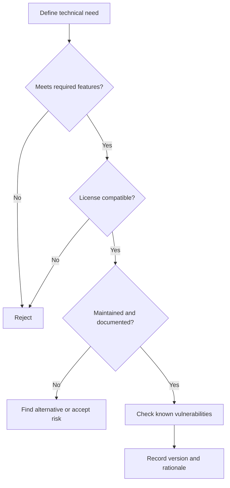

# Week 10 Lecture Pack: Software Reuse and Open Source

**Level:** Undergraduate software engineering · **Suggested class time:** 120 minutes

## Learning outcomes

Students can evaluate a third-party dependency, compare library/framework/SDK roles, recognize common license obligations, and make a documented reuse decision.

## 1. Reuse is an engineering decision

Using a mature library may save time and reduce defects, but it creates a relationship with external maintainers, licenses, release cycles, and security advisories. “Popular on GitHub” is evidence, not a conclusion.

## 2. Library, framework, and SDK

| Item | Who controls the main flow? | Example question |
|---|---|---|
| Library | Your application calls it. | How do I parse JSON? |
| Framework | It calls your application code. | How does a web request reach my handler? |
| SDK | Packaged tools for a platform/service. | How do I call this cloud API? |

## 3. Evaluation workflow

Assess API quality, documentation, maintenance activity, compatibility, transitive dependencies, performance evidence, license, and security.

## 4. License basics

MIT is permissive and typically requires preserving a notice. Apache-2.0 is permissive and includes patent language. GPL is copyleft and may require distribution of corresponding source under GPL when distributing a derivative work. License analysis depends on jurisdiction and distribution model; consult appropriate policy for real products.

## 5. Supply-chain hygiene

Pin known-good versions, review updates, generate a dependency inventory (SBOM where appropriate), and remove unused packages. A dependency that is not called is still code you may need to patch.

## In-class workshop (35 minutes)

Teams evaluate SQLAlchemy, Peewee, and Tortoise ORM for a small Python service. Use a shared table with criteria, evidence links, risks, and a recommendation. A different team challenges one assumption.

## Check for understanding

- Why can a small dependency create a large security surface?
- Does an open-source license mean “no obligations”?
- When might writing a small internal utility be safer than adopting a package?

## Homework

Write a one-page evaluation memo and include a CSV with three libraries, licenses, maintenance indicators, and a final recommendation.

## Suggested 18-slide teaching sequence

1. **Title and reuse dilemma** — Build, buy, borrow, or integrate?
2. **Benefits of reuse** — Time, quality, ecosystem, and support.
3. **Costs of reuse** — Security, maintenance, license, lock-in.
4. **Library/framework/SDK table** — Identify who controls application flow.
5. **Evaluation criteria** — Feature fit before popularity.
6. **Documentation evidence** — Look for examples, API references, and migration guides.
7. **Maintenance evidence** — Releases, issue response, contributor health.
8. **Dependency graph** — Direct versus transitive obligations.
9. **Security evidence** — Advisories, patch cadence, reproducibility.
10. **License basics** — MIT, Apache-2.0, GPL at a conceptual level.
11. **Compatibility caution** — Explain why distribution context matters.
12. **Decision workflow** — Walk the Mermaid selection gate.
13. **Version pinning** — Repeatable builds and controlled updates.
14. **SBOM concept** — Know what software is inside the product.
15. **Ethics of reuse** — Attribution, contribution, respectful issue reports.
16. **ORM comparison lab** — Teams gather evidence for three options.
17. **Recommendation defense** — Challenge assumptions, not people.
18. **Exit ticket** — State one reason to reject an otherwise useful library.
