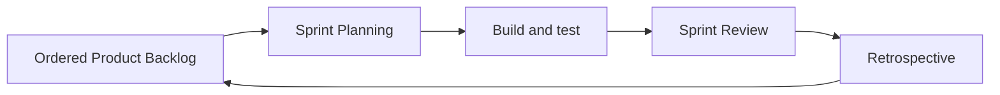

# Week 11 — Scrum Sprint Loop

```mermaid
flowchart LR
    Backlog[Ordered Product Backlog] --> Planning[Sprint Planning]
    Planning --> Sprint[Build and test]
    Sprint --> Review[Sprint Review]
    Review --> Retro[Retrospective]
    Retro --> Backlog
```

The Product Owner prioritizes value; the development team selects a feasible sprint goal.
