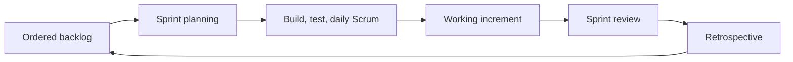

# Week 11 Lecture Pack: Agile Project Management and Scrum

**Level:** Undergraduate software engineering · **Suggested class time:** 120 minutes

## Learning outcomes

Students can name Scrum accountabilities, events, and artifacts; refine backlog items; estimate with relative points; and facilitate a concise stand-up and retrospective.

## 1. Scrum is an empirical framework

Scrum relies on transparency, inspection, and adaptation. It does not guarantee delivery or replace engineering discipline. A sprint is a short, fixed timebox in which a team works toward a valuable, testable goal.

## 2. Accountabilities and artifacts

| Item | Purpose |
|---|---|
| Product Owner | Maximizes product value and orders the backlog. |
| Scrum Master | Helps the team use Scrum and removes process impediments. |
| Developers | Build a usable increment and own the plan for the sprint. |
| Product Backlog | Ordered future work. |
| Sprint Backlog | Selected work plus plan for the sprint goal. |
| Increment | Integrated, potentially releasable result. |

## 3. The sprint feedback cycle

## 4. Estimation is not a promise

Story points compare relative complexity, uncertainty, and effort. Fibonacci values (1, 2, 3, 5, 8, 13) encourage discussion rather than false precision. If estimates differ widely, ask what assumptions differ. Use historical velocity only as a planning signal.

## 5. Healthy events

The Daily Scrum answers: What progress did we make toward the sprint goal? What will we do next? What is blocking us? It is for developers to plan, not a status report for a manager. A retrospective should name one experiment for the next sprint, with an owner.

## In-class workshop (45 minutes)

Build a 12-item backlog for the library system. Write user stories, estimate with planning poker, order by value and risk, select a realistic sprint goal, and run a five-minute mock planning session.

## Check for understanding

- Who decides how developers accomplish a backlog item?
- Why should a sprint goal be more than a list of tickets?
- What is a useful retrospective outcome?

## Homework

Create a board with 10–15 items, estimates, priorities, a sprint goal, and notes from a mock planning meeting.

## Suggested 18-slide teaching sequence

1. **Title and planning question** — How can a team learn while delivering?
2. **Agile values context** — Feedback and adaptation over rigid prediction.
3. **Scrum framework** — Transparency, inspection, adaptation.
4. **Accountabilities** — Product Owner, Scrum Master, Developers.
5. **Artifacts** — Product Backlog, Sprint Backlog, Increment.
6. **Product goal** — Long-term outcome versus individual tickets.
7. **Backlog refinement** — Split, clarify, and order work.
8. **User-story review** — Value and acceptance criteria.
9. **Story points** — Relative complexity and uncertainty.
10. **Planning poker** — Surface assumptions behind differing estimates.
11. **Velocity caution** — Forecasting signal, not a productivity score.
12. **Sprint planning** — Select work that supports one sprint goal.
13. **Daily Scrum** — Adapt today’s plan around the goal.
14. **Sprint review** — Demonstrate increment and collect feedback.
15. **Retrospective** — Choose one concrete improvement experiment.
16. **Board-building lab** — Turn library ideas into ordered work.
17. **Mock planning meeting** — Negotiate scope under capacity limits.
18. **Exit ticket** — Write a sprint goal in one outcome-focused sentence.
