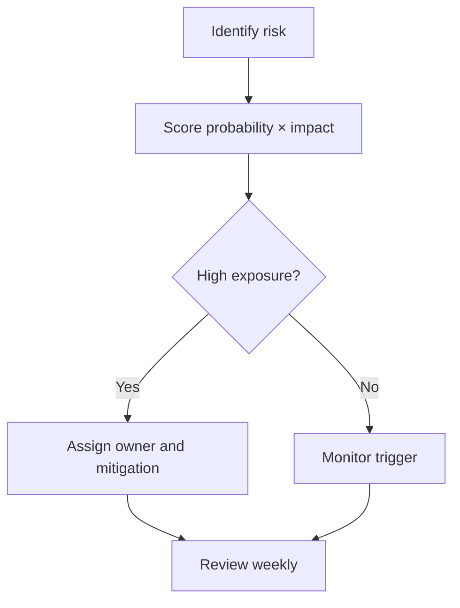

# Week 12 — Risk Response Workflow

```mermaid
flowchart TD
    Identify[Identify risk] --> Score[Score probability × impact]
    Score --> High{High exposure?}
    High -- Yes --> Mitigate[Assign owner and mitigation]
    High -- No --> Monitor[Monitor trigger]
    Mitigate --> Review[Review weekly]
    Monitor --> Review
```

Example: *A third-party API may change.* Trigger: failed contract test. Mitigation: version the client and keep a fallback response.
