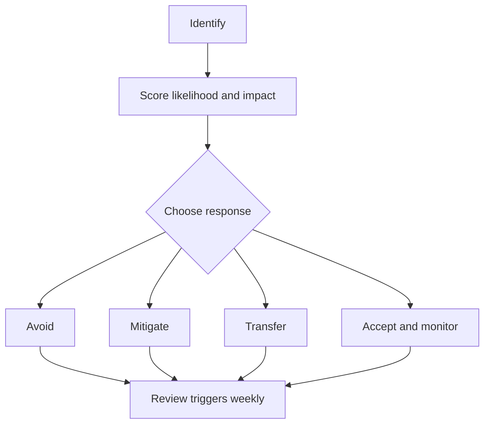

# Week 12 Lecture Pack: Risk Management and Project Estimation

**Level:** Undergraduate software engineering · **Suggested class time:** 120 minutes

## Learning outcomes

Students can maintain a risk register, score probability and impact, choose risk responses, apply PERT estimates, and explain a simple Monte Carlo delivery forecast.

## 1. Risk is uncertain future impact

A risk is not the same as an issue. “The database is down” is an issue; “The hosted database may be unavailable during launch” is a risk. Risk management identifies uncertainty early so the team can act before it becomes an emergency.

## 2. Risk register

| Risk | Probability | Impact | Owner | Trigger | Response |
|---|---:|---:|---|---|---|
| API vendor changes contract | Medium | High | Backend lead | Contract test fails | Version client and fallback response |
| Key developer unavailable | Low | High | Team lead | Absence exceeds 3 days | Pairing and documentation |

## 3. Risk response workflow

Assign every material risk an owner and a visible trigger. A mitigation without an owner is merely a wish.

## 4. Estimation with PERT

For optimistic `O`, most likely `M`, and pessimistic `P` durations, the PERT expected duration is `(O + 4M + P) / 6`. Example: `O=2`, `M=5`, `P=11` days gives `(2 + 20 + 11)/6 = 5.5` days. State assumptions; an estimate is a model, not a fact.

## 5. Monte Carlo intuition

Instead of selecting one duration, sample possible durations many times based on uncertainty. The 50th percentile is a median forecast; the 85th percentile is a more cautious commitment. Results are only as trustworthy as the input distributions and independence assumptions.

## In-class workshop (40 minutes)

Teams produce six project risks, score them, define two triggers, and calculate three PERT estimates. Discuss why two equally scored risks may need different actions.

## Check for understanding

- Why does “accept” not mean “ignore”?
- What would make a Monte Carlo forecast falsely confident?
- Which risk should be escalated first: high impact/low probability or medium impact/high probability?

## Homework

Submit a risk register, a reproducible simulation notebook, percentile forecast, and one-slide executive summary.

## Suggested 18-slide teaching sequence

1. **Title and uncertainty prompt** — What can derail a good plan?
2. **Risk versus issue** — Identify uncertain future events separately from current problems.
3. **Risk categories** — Technical, schedule, resource, external, security.
4. **Register fields** — Description, probability, impact, owner, trigger, response.
5. **Probability/impact matrix** — Use as a conversation aid, not false precision.
6. **Risk appetite** — Explain why contexts tolerate different exposure.
7. **Response options** — Avoid, mitigate, transfer, accept.
8. **Triggers and owners** — Convert a list into actionable monitoring.
9. **Risk workflow diagram** — Follow identify through weekly review.
10. **Estimation fallacies** — Optimism bias and hidden work.
11. **PERT inputs** — Optimistic, likely, pessimistic values.
12. **PERT calculation** — Work one numeric example together.
13. **Monte Carlo intuition** — Sample uncertainty rather than choose one date.
14. **Percentiles** — Compare median and cautious commitment.
15. **Assumption review** — Dependencies and data quality shape the forecast.
16. **Risk-register lab** — Teams develop six project risks.
17. **Executive summary practice** — Communicate exposure and decision needed.
18. **Exit ticket** — Give a trigger for one project risk.
