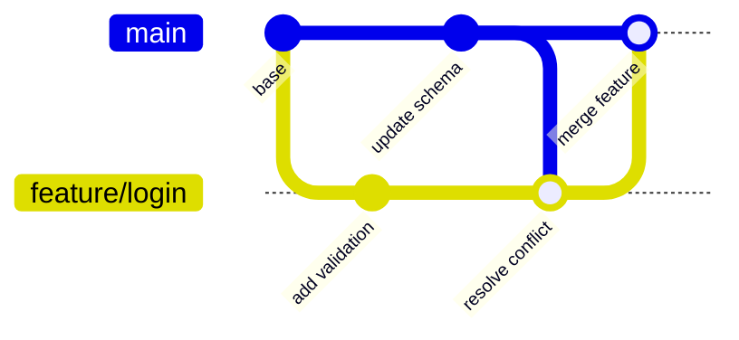

# Week 13 — Safe Git Integration

```mermaid
gitGraph
   commit id: "base"
   branch feature/login
   checkout feature/login
   commit id: "add validation"
   checkout main
   commit id: "update schema"
   checkout feature/login
   merge main id: "resolve conflict"
   checkout main
   merge feature/login id: "merge feature"
```

Resolve a conflict by understanding both changes, testing the result, and writing a commit message that explains the resolution.
