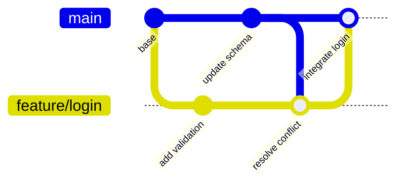

# Week 13 Lecture Pack: Configuration Management and Version Control

**Level:** Undergraduate software engineering · **Suggested class time:** 120 minutes

## Learning outcomes

Students can explain branches, merges, rebases, and cherry-picks; resolve a conflict deliberately; manage configuration by environment; and write useful commit messages.

## 1. Configuration is versioned system behavior

Configuration includes feature flags, service URLs, log levels, deployment manifests, and dependency versions. Keep non-secret configuration in version control; store secrets in an approved secret manager or environment variables. Treat configuration changes as code changes: review, test, and trace them.

## 2. Branches are movable labels

A branch is a named pointer to a commit, not a separate copy of the project. A merge combines histories; a rebase replays commits on a new base. Rebase private feature work for a tidy history, but avoid rebasing public shared branches because it changes commit identities.



## 3. Conflict resolution is a design decision

A conflict means Git cannot safely choose between overlapping changes. Read the intent of both branches, run tests, preserve required behavior, then remove conflict markers.

```bash
git status
# edit each conflicted file intentionally
git add <resolved-file>
git commit -m "Resolve schema conflict in registration flow"
git log --oneline --graph
```

Never resolve a conflict by selecting “ours” or “theirs” blindly. That may discard a feature or bug fix.

## 4. Cherry-pick carefully

`git cherry-pick <commit>` applies one existing commit onto the current branch. It is useful for an urgent isolated fix, but repeated cherry-picks can duplicate history. Prefer a normal merge when integrating a coherent feature branch.

## 5. Commit messages are future documentation

Use an imperative summary: “Add password validation” rather than “Added stuff.” Explain non-obvious motivation in the body. A commit should compile, pass relevant tests, and avoid mixing unrelated formatting changes with behavioral work.

## In-class workshop (40 minutes)

Pairs create two branches that edit the same line differently. They merge, inspect the conflict, explain both intentions, write a combined resolution, test it, and produce a short resolution guide for a junior developer.

## Check for understanding

- Why can rebasing a shared branch confuse teammates?
- What information should be checked before resolving a conflict?
- When is cherry-pick preferable to merging a whole branch?

## Homework

Submit a conflict-resolution log with commands, screenshots or terminal output, the final commit hash, and a beginner-friendly guide.

## Suggested 18-slide teaching sequence

1. **Title and history prompt** — Why is “latest version” not enough?
2. **Configuration definition** — Code, settings, dependencies, environments, and secrets.
3. **Version-control review** — Status, add, commit, log, branch, merge.
4. **Commit graph model** — Explain commits, parents, and branch labels.
5. **Branches** — Isolate work without copying the repository.
6. **Merge** — Join histories and preserve shared ancestry.
7. **Rebase** — Replay private work on a new base; discuss public-history risk.
8. **Cherry-pick** — Move one isolated fix deliberately.
9. **Merge conflict anatomy** — Read markers and competing intentions.
10. **Live resolution** — Inspect, edit, add, test, commit.
11. **Resolution anti-patterns** — Never blindly choose ours/theirs.
12. **Clean commit messages** — Intent, scope, and useful body text.
13. **YAML and JSON configuration** — Structure, validation, and environment overrides.
14. **Secrets management** — Why secrets differ from ordinary configuration.
15. **Change control** — Review and trace operational configuration changes.
16. **Paired conflict lab** — Create and resolve a deliberate conflict.
17. **Guide-writing practice** — Explain commands for a junior developer.
18. **Exit ticket** — Decide merge, rebase, or cherry-pick for a scenario.
