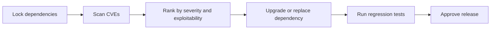

# Week 14 — Dependency Security Gate

```mermaid
flowchart LR
    Lock[Lock dependencies] --> Scan[Scan CVEs]
    Scan --> Triage[Rank by severity and exploitability]
    Triage --> Fix[Upgrade or replace dependency]
    Fix --> Test[Run regression tests]
    Test --> Approve[Approve release]
```

Treat a CVE as a prioritization input: confirm reachability and business impact before choosing a fix window.
