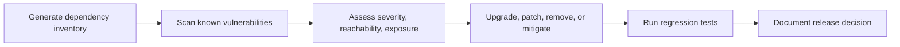

# Week 14 Lecture Pack: Dependency Management and Security

**Level:** Undergraduate software engineering · **Suggested class time:** 120 minutes

## Learning outcomes

Students can describe dependency repositories and lockfiles, interpret a vulnerability report, prioritize findings with context, and perform a lightweight threat model.

## 1. Dependencies are part of the attack surface

Modern applications include direct and transitive dependencies. A package can be vulnerable even if students never import it directly. Inventory, version control, scanning, and timely updates reduce exposure, but scanners do not replace reasoning.

## 2. Repository and lockfile roles

A package registry such as PyPI distributes packages. A private proxy or mirror can cache approved artifacts, improve availability, and enforce policy. A lockfile records exact resolved versions; it turns “works on my machine” into a repeatable installation.

## 3. Security gate

Prioritize by more than CVSS score: Is the affected code reachable? Is it exposed to untrusted input? Is a reliable exploit known? What compensating controls exist? What is the cost of an update?

## 4. Secure coding feedback tools

Static analysis tools can identify code smells, duplicated code, unsafe APIs, and patterns associated with vulnerabilities. A finding is a prompt for review, not proof of exploitability. Configure rules intentionally and avoid training teams to ignore a noisy report.

## 5. Lightweight threat modeling

For each asset, ask who needs to access it, what trust boundaries it crosses, and what could go wrong.

| Asset | Threat | Mitigation |
|---|---|---|
| Password | Credential theft | Hash with a modern password algorithm; use TLS. |
| JWT | Token replay | Short expiry, signature validation, secure storage. |
| Database | Unauthorized access | Least-privilege accounts, network controls, backups. |

## In-class workshop (40 minutes)

Run a dependency scan for the Week 9 service. Teams choose three findings, classify urgency, identify whether the vulnerable path is used, and propose a fix. Then draw a data-flow diagram for registration and mark trust boundaries.

## Check for understanding

- Why might a critical CVE not be the first fix?
- What is the difference between a package mirror and a lockfile?
- What makes a secret different from ordinary configuration?

## Homework

Submit a security/quality audit, prioritized remediation plan, one implemented fix, and pull-request rationale.

## Suggested 18-slide teaching sequence

1. **Title and security prompt** — What code runs because we installed one package?
2. **Attack surface** — First-party, direct, and transitive dependency code.
3. **Package registries** — Public index, private proxy, artifact repository.
4. **Lockfiles** — Exact resolution and reproducible builds.
5. **Dependency inventory** — Why teams need an SBOM-like view.
6. **Vulnerability scanning** — What a scanner knows and what it cannot know.
7. **CVE reading** — Affected version, condition, severity, remediation.
8. **Priority context** — Reachability, exposure, exploitability, business impact.
9. **Security gate diagram** — Scan, triage, fix, test, release decision.
10. **Update strategies** — Upgrade, patch, remove, isolate, compensate.
11. **Static analysis** — Code quality and security feedback loops.
12. **False positives and noise** — Tune responsibly instead of ignoring reports.
13. **Threat-model basics** — Asset, actor, boundary, threat, mitigation.
14. **Registration data-flow review** — Trace password and token boundaries.
15. **Least privilege** — Database account and service permission examples.
16. **Audit lab** — Triage three dependency findings.
17. **Fix-review practice** — Justify urgency and verify regression coverage.
18. **Exit ticket** — Explain why CVSS alone is not a release decision.
