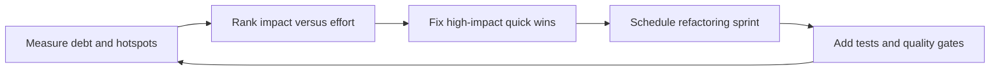

# Week 15 — Technical Debt Roadmap

```mermaid
flowchart LR
    Measure[Measure debt and hotspots] --> Rank[Rank impact versus effort]
    Rank --> Quick[Fix high-impact quick wins]
    Quick --> Sprint[Schedule refactoring sprint]
    Sprint --> Guardrails[Add tests and quality gates]
    Guardrails --> Measure
```

Track debt interest as the additional delivery time caused by fragile code each sprint.
