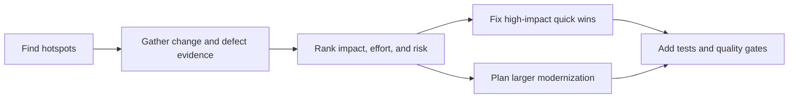

# Week 15 Lecture Pack: Software Evolution, Maintenance, and Technical Debt

**Level:** Undergraduate software engineering · **Suggested class time:** 120 minutes

## Learning outcomes

Students can explain technical debt and debt interest, separate refactoring from rewriting, rank refactoring candidates, and propose a maintainable modernization roadmap.

## 1. Technical debt is a trade-off with future cost

Debt is not simply “old code” or “bad code.” It is an expedient choice that creates future carrying cost: slower changes, higher defect rates, difficult onboarding, and increased operational risk. Some debt is deliberate and rational; hidden debt is dangerous because nobody plans to repay it.

## 2. Symptoms and measurement

Look for repeated defects, unstable tests, long lead time for small changes, duplicated logic, high complexity, outdated dependencies, and ownership gaps. Metrics are signals, not targets: a low complexity number does not guarantee a valuable design.

## 3. Prioritize by impact, effort, and risk

High-churn modules with frequent bugs are better refactoring candidates than stable, ugly code that rarely changes.

## 4. Refactor, rewrite, or wrap?

- **Refactor:** improve structure in small behavior-preserving steps when tests and understanding exist.
- **Rewrite:** replace a bounded component when existing structure blocks required change; high risk if scope is vague.
- **Wrap/strangle:** place a stable interface around legacy code, route one capability at a time to new code, and retire old paths after verification.

## 5. Debt interest calculation

Suppose fragile authentication code adds six hours of rework per sprint. Across 12 sprints, that is 72 hours before counting outages. This simple estimate makes opportunity cost visible; state uncertainty rather than presenting it as exact accounting.

## In-class workshop (40 minutes)

Review the Week 7–9 codebase. Teams identify five candidates, score impact/effort, select one small refactoring, write characterization tests, and present a six-month roadmap with one protected refactoring sprint.

## Check for understanding

- Why can a full rewrite be riskier than incremental modernization?
- What evidence shows debt is harming delivery?
- How do tests change the safety of a refactoring?

## Homework

Submit a technical-debt register, prioritization matrix, debt-interest estimate, and six-month maintenance roadmap.

## Suggested 18-slide teaching sequence

1. **Title and debt analogy** — Speed now can create interest later.
2. **Debt definition** — Separate deliberate trade-off from accidental decay.
3. **Debt types** — Code, tests, dependencies, architecture, documentation, operations.
4. **Symptoms** — Slow changes, regressions, flaky tests, long onboarding.
5. **Evidence gathering** — Change frequency, incidents, complexity, developer interviews.
6. **Debt interest** — Convert recurring rework into understandable time cost.
7. **Hotspot analysis** — Prefer high-churn, high-defect code.
8. **Impact/effort matrix** — Compare quick wins and strategic work.
9. **Refactoring definition** — Preserve external behavior while improving structure.
10. **Characterization tests** — Learn and protect legacy behavior first.
11. **Refactor loop** — Small change, test, commit, observe.
12. **Rewrite risk** — Hidden requirements and prolonged dual maintenance.
13. **Strangler approach** — Replace a bounded path behind a stable interface.
14. **Quality gates** — Prevent debt from immediately returning.
15. **Roadmap design** — Balance features, reliability, and intentional cleanup.
16. **Hotspot lab** — Rank five candidates from Weeks 7–9.
17. **Stakeholder pitch** — Argue for a refactoring sprint using evidence.
18. **Exit ticket** — Name one metric and its limitation.
