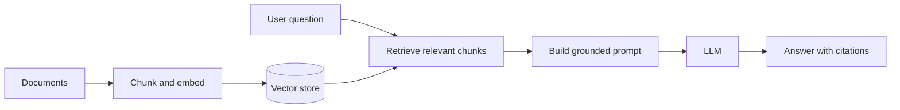

# Week 16 — Retrieval-Augmented Generation (RAG) Agent

```mermaid
flowchart LR
    Docs[Documents] --> Chunk[Chunk and embed]
    Chunk --> Store[(Vector store)]
    Question[User question] --> Retrieve[Retrieve relevant chunks]
    Store --> Retrieve
    Retrieve --> Prompt[Build grounded prompt]
    Prompt --> LLM[LLM]
    LLM --> Answer[Answer with citations]
```

The agent should refuse to invent facts when retrieval returns insufficient evidence.
