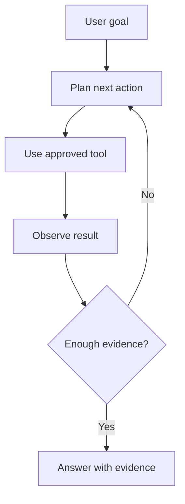
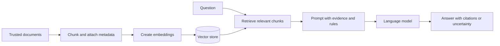

# Week 16 Lecture Pack: AI Agents, Prompt Chaining, and RAG

**Level:** Undergraduate software engineering · **Suggested class time:** 120 minutes

## Learning outcomes

Students can distinguish an LLM from an agent workflow, design a prompt chain, explain retrieval-augmented generation (RAG), evaluate grounded answers, and identify safety and reliability limits.

## 1. Vibe coding needs engineering judgment

Natural-language tools can accelerate scaffolding, explanation, test generation, and iteration. They do not remove the need to define requirements, inspect security-sensitive code, choose architecture, test behavior, or take responsibility for outcomes. Clear constraints and review criteria are part of the prompt.

## 2. Agent loop and harness

An agent usually combines a model with instructions, tools, state, a planner or loop, and guardrails. The harness is the surrounding engineering system that controls inputs, permissions, tool execution, retries, logging, evaluation, and human approval.

## 3. RAG architecture

RAG improves access to supplied knowledge; it does not guarantee truth. Retrieval can miss relevant material, documents can be outdated, and a model can still misinterpret evidence.

## 4. Prompt chaining

Break a complex task into verifiable stages: classify the request, retrieve evidence, draft an answer, check citations, and format output. Pass only necessary state between steps. Define stop conditions, timeouts, and fallbacks for every loop.

## 5. Evaluation and safety

Evaluate with representative questions, known answers, adversarial inputs, unsupported questions, latency, cost, and citation quality. Defend against prompt injection by separating trusted instructions from untrusted retrieved text, limiting tools, and requiring confirmation for consequential actions.

## In-class workshop (45 minutes)

Teams build a small document-Q&A prototype. They choose a tiny trusted corpus, define chunk metadata, prepare ten evaluation questions, and test at least two questions whose answers are not in the corpus. The prototype should say “I do not have enough evidence” instead of fabricating an answer.

## Check for understanding

- What does RAG solve that model fine-tuning does not necessarily solve?
- Why should retrieved text not be treated as system instructions?
- What evidence would make an agent answer trustworthy enough to use?

## Final project

Build a small agent with a visible architecture diagram, documented tools and permissions, evaluation set, failure cases, and a brief reflection on what the human engineer still had to decide.

## Suggested 18-slide teaching sequence

1. **Title and framing** — AI changes workflow, not engineering responsibility.
2. **Vibe coding definition** — Natural-language specification plus critical review.
3. **Where AI helps** — Scaffolding, tests, explanations, transformation, search.
4. **Where AI fails** — Ambiguity, hidden context, security, trade-offs, verification.
5. **Prompt structure** — Goal, context, constraints, output format, acceptance tests.
6. **Prompt chaining** — Split complex tasks into inspectable stages.
7. **LLM versus agent** — One response compared with tool-using control loop.
8. **Agent components** — Model, tools, state, instructions, harness, guardrails.
9. **Agent-loop diagram** — Plan, act, observe, decide, answer.
10. **Tool permissions** — Least privilege and human confirmation.
11. **RAG motivation** — Ground answers in a changing, private corpus.
12. **RAG pipeline** — Chunking, embedding, retrieval, prompt assembly, citation.
13. **Chunking trade-offs** — Context loss, overlap, metadata, update strategy.
14. **Grounded-answer behavior** — Cite evidence or state insufficiency.
15. **Prompt injection** — Treat retrieved text as data, never authority.
16. **Evaluation design** — Known-answer, unsupported, adversarial, cost, latency cases.
17. **Prototype studio** — Teams build and test document Q&A.
18. **Final reflection** — Name a human decision an agent should not make alone.
